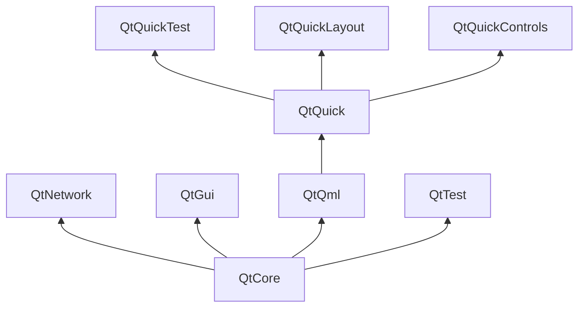

# Qt构建块

Qt 6由许多模块组成。 一般来说，模块是供开发人员使用的库。一些模块是Qt启用平台必需的，形成所谓的 *Qt Essentials Modules* 集合。其他模块是可选的，并形成 *Qt Add-On Modules*。大多数开发人员可能不需要使用后者，但了解它们是很好的，因为它们提供了对常见问题的宝贵解决方案。

## Qt 模块

Qt Essentials 模块是任何支持 Qt 的平台所必需的。它们为使用 Qt Quick 2 开发现代化 Qt 6 应用程序提供了基础。完整的模块列表可以在[Qt 文档模块列表](https://doc.qt.io/qt-6/qtmodules.html#qt-essentials)中找到。

## 核心基本模块

用于开始QML编程的最小Qt 6模块集。

* **Qt Core** - 包含其他模块所需的核心非图形类。
* **Qt D-BUS** - 用于 Linux 上基于 D-Bus 协议的进程间通信的类。
* **Qt GUI** - 图形用户界面(GUI)组件的基础类。包括OpenGL。
* **Qt Network** - 为网络编程提供便利且跨平台的类。
* **Qt QML** - QML和JavaScript语言的类。
* **Qt Quick** - 一个声明式框架，用于构建具有自定义用户界面的高度动态的应用程序。
* **Qt Quick Controls** - 为创建桌面、嵌入式和移动设备的高性能用户界面提供轻量级的 QML 类型。这些类型采用简单的样式架构，非常高效。
* **Qt Quick Layouts** - 布局是用于在用户界面中排列基于Qt Quick 2的项的项目。
* **Qt Quick Test** - 一个 QML 应用的单元测试框架，其中测试用例被编写为 JavaScript 函数。
* **Qt Test** - 用于对 Qt 应用程序和库进行单元测试的类。
* **Qt Widgets** - 用于在 C++ 程序中扩展 Qt 图形用户界面的类。

## Qt 附加模块

除了基本模块以外，Qt 也提供了一些针对特定目的的附加模块。许多附加模块要么是特性完备的，是为了向后兼容而存在的，要么仅适用于某些平台。下面是一些可用的附加模块的列表，但请确保您在[Qt 文档的附加模块列表](https://doc.qt.io/qt-6/qtmodules.html#qt-add-ons)和下面的列表中了解它们所有的信息。

* **Network**: Qt Bluetooth / Qt Network Authorization
* **UI Components**: Qt Quick 3D / Qt Quick Timeline / Qt Charts / Qt Data Visualization / Qt Lottie Animation / Qt Virtual Keyboard
* **Graphics**: Qt 3D / Qt Image Formats / Qt OpenGL / Qt Shader Tools / Qt SVG / Qt Wayland Compositor
* **Helper**: Qt 5 Core Compatibility APIs / Qt Concurrent / Qt Help / Qt Print Support / Qt Quick Widgets / Qt SCXML / Qt SQL / Qt State Machine / Qt UI Tools / Qt XML

::: 提示
由于这些模块不属于发布的一部分，每个模块的状态可能会因为活跃的贡献者数量和测试情况的不同而有所不同。
:::

## 支持的平台

Qt 支持各种平台，包括所有主要的桌面和嵌入式平台。通过 Qt 平台抽象层，现在在自己的平台上移植 Qt 比以往任何时候都更加容易了。

测试 Qt 6 在平台上是一项耗时的工作。Qt 项目选择了一个子集平台来构建参考平台集。通过系统测试彻底测试这些平台，以确保最佳质量。但请记住，没有哪个代码是一点错误都没有的。

# Qt 项目

来自 [Qt Wiki](http://wiki.qt.io/)：

> “Qt的WIKI是一个基于功绩和共识的社区，旨在推动Qt的发展。任何分享这个兴趣的人都可以加入社区，参与决策过程，并为Qt的发展做出贡献。”

Qt Wiki 是 Qt 用户和贡献者分享见解的地方。它是其他用户进行贡献的基础。最大的贡献者是 The Qt Company，它也持有 Qt 的商业版权。

Qt 有开源及商业两个方面服务于企业。商业服务主要针对那些无法或者不愿意遵守开源许可的企业。如果没有商业服务，这些企业将无法使用 Qt，也无法让 Qt Company 给 Qt 项目贡献这么多代码。

有许多全球性的公司使用 Qt 在不同平台上从事咨询和产品开发。此外，还有许多依赖 Qt 作为其主要开发库的开源项目和开源开发人员。能够成为这个充满活力的社区的一员，并使用这些很棒的工具和库进行工作，感觉真好。这能让你成为一个更优秀的人吗？或许吧 :-)

