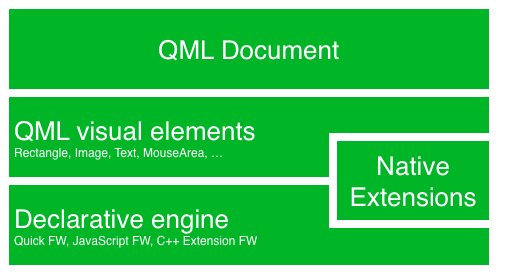
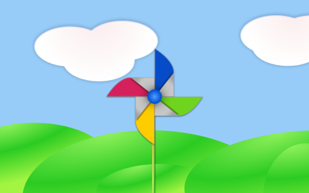

# Qt 6 介绍

## Qt Quick

Qt Quick 是在 Qt 6 中使用的用户界面技术的总称。它在 Qt 4 中首次亮相，现在在 Qt 6 中得到扩展。 Qt Quick 本身是由多种技术组成的：

* QML - 用户界面的标记语言
* JavaScript - 动态脚本语言
* Qt C++ - 一个高度可移植的增强C++库



与 HTML 类似，QML 也是一种标记语言，它由标签 (在 Qt Quick 中被称为类型) 组成，这些标签用大括号括起来: `Item {}`。它从底层开始为用户界面的创建、开发人员的速度和易读性而设计。用户界面可以使用 JavaScript 代码进一步增强。 Qt C++ 可以用于轻松扩展 Qt Quick 的本地功能。简而言之，声明式的 UI 被称为前端，本地部分被称为后端。这使您可以将应用程序的计算密集和本地操作与用户界面部分分开。

在一个典型的项目中，前端使用 QML/JavaScript 进行开发。与系统接口和执行重要任务的后端代码则使用 Qt C++ 编写。这种方式自然地将设计导向的开发人员和功能导向的开发人员区分开来。通常使用 Qt Test 这个 Qt 单元测试框架对后端进行测试，并将其导出供前端使用。

## 理解用户界面

让我们使用Qt Quick创建一个简单的用户界面，展示QML语言的一些方面。最终，我们将会拥有一枚旋转叶片的纸风车。



我们从一个空白的文档 `main.qml` 开始。所有的 QML 文档都需要有后缀 `.qml`。作为一种标记语言（例如 HTML），一个 QML 文档需要有一个且仅有一个根类型。在我们的例子中，是 `Image` 类型，其宽度和高度根据背景图像的几何形状确定：

```qml
import QtQuick

Image {
    id: root
    source: "images/background.png"
}
```

作为 QML 不限制根类型选择的类型，我们使用设置为我们的背景图像的具有 source 属性的 `Image` 类型作为根。


::: 提示
每种类型都有属性。例如，图像具有`width`和`height`属性，每个属性都持有像素的数量。它还具有其他属性，比如 `source`。由于图像类型的大小是从图像大小自动推导出来的，因此我们不需要自己设置`width`和`height`属性。
:::

最标准的类型位于`QtQuick`模块中，在`.qml`文件开头的import语句中可以获得该模块。

`id`是一个特殊且可选的属性，它包含一个标识符，可用于在文档的其他位置引用其关联类型。重要提示：`id`属性在设置后无法更改，并且无法在运行时设置。使用`root`作为根类型的`id`是本书中使用的一种约定，以使在较大的QML文档中引用最顶层的类型变得可预测。

前景元素，代表用户界面中的杆和风车，作为单独的图像包含在其中。


我们希望将杆水平放置在背景中心，但在垂直方向上向底部偏移。我们希望将风车放置在背景中间。

虽然这个初学者示例只使用了图片类型，但随着我们的进展，您将创建由许多不同类型组成的更复杂的用户界面。

```qml
Image {
    id: root
    ...
    Image {
        id: pole
        anchors.horizontalCenter: parent.horizontalCenter
        anchors.bottom: parent.bottom
        source: "images/pole.png"
    }

    Image {
        id: wheel
        anchors.centerIn: parent
        source: "images/pinwheel.png"
    }
    ...
}
```

将风车放置在中央需要使用一个复杂的属性——anchor。Anchor可以指定父项和同级对象之间的几何关系。例如，将我放置在另一种类型的中心位置（`anchors.centerIn: parent`）。在两端都有 left, right, top, bottom, centerIn, fill, verticalCenter  和 horizontalCenter 关系。当然，当两个或更多的锚点一起使用时，它们应该相互补充：例如，将一个类型的左侧固定在另一个类型的顶部是没有意义的。

对于风车，仅需要一个简单的锚点来固定。

::: 提示
有时你想要做微调，例如稍稍向右偏移文本的位置中心。可以使用`anchors.horizontalCenterOffset`或`anchors.verticalCenterOffset` 完成微调。类似的调整属性对于所有其他锚点也是可用的。请参考文档获取所有锚点属性的完整列表
:::

::: 提示    
把一个图片放在根类型（`Image`）的子类型下，可以说明声明式语言的一个重要概念。你按照图层和分组的顺序描述了用户界面的外观，最上面的图层（我们的背景图片）首先被绘制，然后子图层按照包含它们的类型的本地坐标系在其上绘制。
:::

为了使展示更加有趣，让我们让场景互动起来。想法是当用户在场景中按下鼠标时旋转轮子。

我们使用 `MouseArea` 类型，并将其覆盖我们根类型的整个区域。

```qml
Image {
    id: root
    ...
    MouseArea {
        anchors.fill: parent
        onClicked: wheel.rotation += 90
    }
    ...
}
```

鼠标区域在用户单击其覆盖区域内时发出信号。你可以通过覆盖 `onClicked` 函数连接到这个信号。当连接了一个信号后，这意味着它对应的函数或函数组在信号发出时被调用。在本例中，我们说，当鼠标在鼠标区域单击时，`id` 为 `wheel` 的类型（即风车图像）应旋转 +90 度。

::: 提示
这个技巧适用于每一个信号，命名约定为 `on` + 信号名 + 首字母大写。此外，所有属性的值改变时都会发出信号。对于这些信号，命名约定为：
:::

```js
    `on${property}Changed`
```

比如，如果一个`width` 属性被更改，你可以使用 `onWidthChanged: print(width)` 来监听。

风车现在将在用户单击时旋转，但旋转是一次性跳跃，而不是随着时间的推移而流畅移动。我们可以使用动画来实现平滑移动。动画定义了在一段时间内如何发生属性更改。为了实现这一点，我们使用`Animation`类型的被称为`Behavior`的属性。每当属性更改时，该`Behavior`为每个应用于该属性的更改指定了一个动画。换句话说，每当属性更改时，动画都会运行。这仅是在QML中执行动画的众多方法之一。

```qml
Image {
    id: root
    Image {
        id: wheel
        Behavior on rotation {
            NumberAnimation {
                duration: 250
            }
        }
    }
}
```

现在，每当风车的旋转属性发生变化时，它将使用持续时间为250毫秒的`NumberAnimation`进行动画处理。因此，每90度旋转将耗时250毫秒，产生一个漂亮的平滑旋转。


::: 提示
实际上您不会看到轮子变模糊。这只是为了表示它正在旋转。（有一个模糊的轮子在assets文件夹中，以防您想要尝试它。）
:::


现在，轮子看起来好多了，行为也表现得很好，同时还提供了一个非常简洁的基本介绍，说明了 Qt Quick 编程的工作原理。

